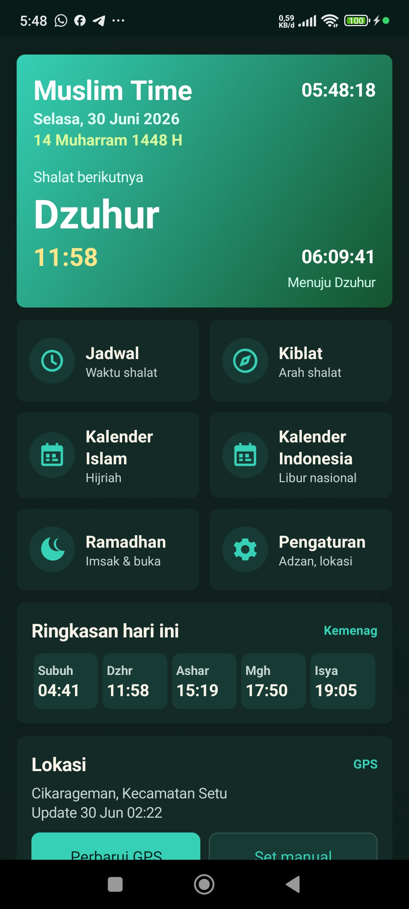
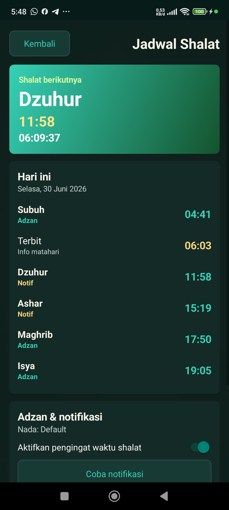
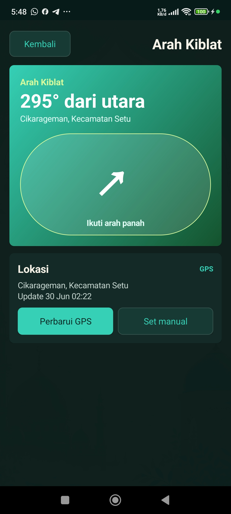
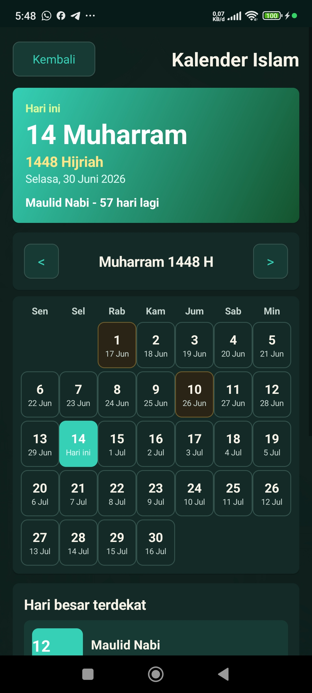
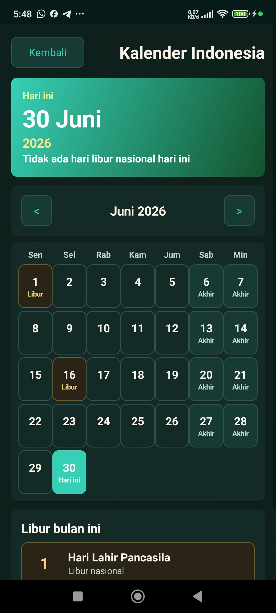

# Muslim Time

Muslim Time adalah aplikasi Android sederhana untuk membantu pengguna melihat jadwal shalat, menerima pengingat adzan/notifikasi, mengecek arah kiblat, melihat kalender Islam dan kalender Indonesia, serta memantau jadwal Ramadhan.

Aplikasi ini dibuat dengan fokus pada tampilan yang ringan, mudah dipahami, dan hemat baterai.

## Fitur Utama

- Jadwal shalat berdasarkan lokasi pengguna.
- Pengingat shalat dengan pilihan mode: adzan, notifikasi biasa, atau mati.
- Arah kiblat dengan kompas.
- Kalender Islam dengan penanda hari ini dan hari besar.
- Kalender Indonesia dengan hari libur nasional dan cuti bersama.
- Mode Ramadhan untuk sahur, imsak, Subuh, buka puasa, dan Isya.
- Tema terang dan gelap.
- Lokasi manual sebagai fallback.
- Strategi lokasi hemat baterai.

## Screenshot

<table>
  <tr>
    <td align="center"><strong>Dashboard</strong></td>
    <td align="center"><strong>Jadwal Shalat</strong></td>
  </tr>
  <tr>
    <td></td>
    <td></td>
  </tr>
  <tr>
    <td align="center"><strong>Arah Kiblat</strong></td>
    <td align="center"><strong>Kalender Islam</strong></td>
  </tr>
  <tr>
    <td></td>
    <td></td>
  </tr>
  <tr>
    <td align="center"><strong>Kalender Indonesia</strong></td>
    <td align="center"><strong></strong></td>
  </tr>
  <tr>
    <td></td>
    <td></td>
  </tr>
</table>

## Mode Ramadhan

Mode Ramadhan menyediakan:

- Jadwal sahur.
- Imsak, dihitung 10 menit sebelum Subuh.
- Jadwal buka puasa berdasarkan Maghrib.
- Countdown menuju Sahur, Imsak, atau Buka.
- Kartu Ramadhan di dashboard saat bulan Ramadhan.

## Strategi Lokasi Hemat Baterai

Muslim Time tidak menjalankan GPS aktif terus-menerus di background.

Alurnya:

1. Saat aplikasi pertama dibuka, aplikasi mengambil lokasi sekali.
2. Setelah lokasi didapat, aplikasi menyimpan kota/kecamatan.
3. Update otomatis hanya memakai passive significant location update.
4. Jadwal shalat dihitung ulang hanya jika lokasi berubah signifikan dan kota berubah.
5. Pengguna tetap bisa memakai lokasi manual.

Pendekatan ini menjaga jadwal tetap relevan tanpa membebani baterai.

## Teknologi

- Native Android
- Java
- Gradle
- Minimum SDK 23
- Target SDK 36

## Struktur Project

```text
MuslimTime/
├── app/
│   ├── src/main/java/com/muslimtime/app/
│   │   ├── location/      
│   │   ├── notify/       
│   │   ├── prayer/        
│   │   ├── MainActivity.java
│   │   ├── Preferences.java
│   │   └── SplashActivity.java
│   ├── src/main/res/      
│   └── build.gradle
├── gradle/
├── build.gradle
├── settings.gradle
├── gradlew
└── gradlew.bat
```

## Permission

| Permission | Fungsi |
| --- | --- |
| Location | Mengambil lokasi untuk jadwal shalat dan arah kiblat |
| Notification | Menampilkan pengingat shalat |
| Exact alarm | Menjadwalkan pengingat shalat lebih tepat |
| Wake lock | Menjaga proses adzan/notifikasi tetap selesai |

## Cara Build

Pastikan Android SDK dan JDK 17 sudah tersedia.

Windows:

```powershell
.\gradlew.bat assembleDebug
```

macOS/Linux:

```bash
./gradlew assembleDebug
```

APK debug akan dibuat di:

```text
app/build/outputs/apk/debug/app-debug.apk
```

## Build Release

Windows:

```powershell
.\gradlew.bat assembleRelease
```

APK release akan dibuat di:

```text
app/build/outputs/apk/release/app-release.apk
```

Catatan: konfigurasi release saat ini masih memakai debug signing untuk testing lokal. Untuk publish resmi, gunakan keystore produksi dan jangan commit file keystore ke GitHub.

## File yang Tidak Di-commit

Project ini memakai `.gitignore` untuk menghindari file lokal dan hasil build masuk repository.

Contoh file/folder yang diabaikan:

- `.gradle/`
- `build/`
- `app/build/`
- `local.properties`
- APK/AAB hasil build
- file keystore/signing

## Catatan Data

- Jadwal shalat dihitung lokal berdasarkan metode yang tersedia di aplikasi.
- Kalender Indonesia saat ini memuat data libur nasional/cuti bersama 2026.
- Aplikasi ini bukan pengganti rujukan resmi keagamaan atau keputusan pemerintah terbaru.

## License

Belum ditentukan.
